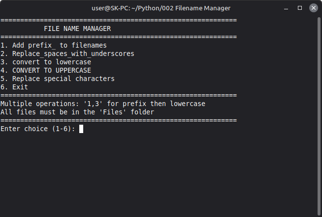
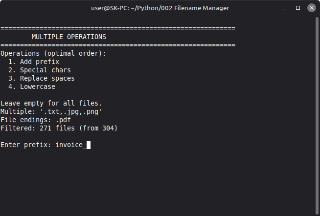

# File Name Manager (Python)

A small cross-platform file renaming tool ported from my C# project to Python.
I wrote this to learn more about Python. In my Tests all functions worked very well.

Batch-rename files inside a local `Files/` directory using single or chained operations.  
Designed for fast cleanup of file names for cross-OS compatibility, formatting, and automation.

## Features
- Add prefix to filenames
- Replace spaces with underscores
- Convert to lower or uppercase
- Replace special characters (ä -> ae, ö -> oe, ß -> ss, é -> e, etc.)
- Chain multiple operations in one step (e.g. `1,3` = prefix + lowercase)
- Optional file extension filtering (`.txt,.png,...`)
- Preview and confirmation before renaming
- Skip logic to avoid unnecessary or duplicate renames

## Use Cases
- Preparing files for scripts, servers, or shared storage
- Normalizing mixed file naming styles
- Removing unsupported or special characters for cross-platform use
- Bulk formatting after exports, downloads, or backups

## Screenshots

